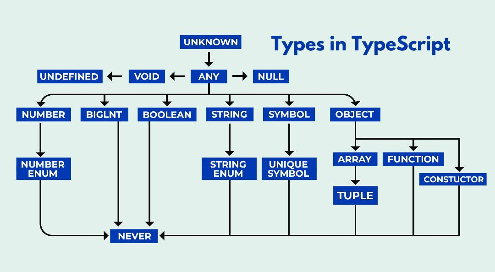

# TypeScript 

TypeScript is a statically typed superset of JavaScript that adds features like static types, interfaces, and more to help you write safer and more maintainable code. It compiles to plain JavaScript, making it compatible with all JavaScript runtimes and environments.


## Why Learn TypeScript?

- **Static Typing:** TypeScript helps catch type-related errors at compile time, reducing runtime errors and improving code quality.

- **IDE Support:** Popular code editors like Visual Studio Code offer excellent TypeScript support, including autocompletion and error checking.

- **Scalability:** TypeScript is particularly useful for large codebases as it provides better tooling and code organization.

- **Strong Community:** TypeScript has a vibrant community with a wealth of learning resources and libraries.

## Installation

TypeScript can be installed globally using npm (Node Package Manager). If you don't have Node.js and npm installed, you can download them from [the official website](https://nodejs.org/).

To install TypeScript globally, open your terminal and run:

```bash
npm install -g typescript
```
You can also set up a TypeScript project with a tsconfig.json file. To initialize a TypeScript project, run:

```bash
tsc --init
```
## If error occurs
Use tsc.cmd 
```bash
tsc.cmd --init
```
## Compile Code

```bash
tsc yourfile.ts
```

## For Continuous Watching

```bash
tsc yourfile.ts -w
```
## Type Annotations
Type annotations are expressed by using a colon ( : ) followed by the desired type after the variable or fuction paramenter declaration.

```bash
let Num:number = 10;
let myName:string = "Surendra kumar";
```
## Types in Typescript


